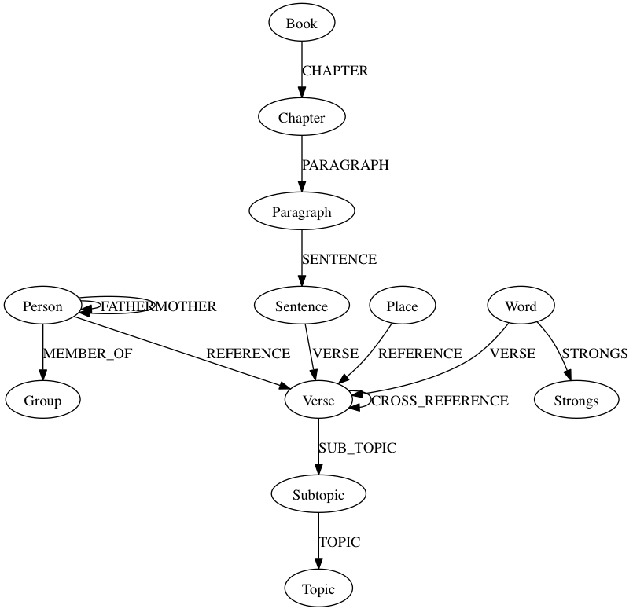

# MetaV Neo4j Graph

This repo suggests a domain model for the data in MetaV inside a graph database Neo4j

[](doc/MetaV.png)

## Getting Started

These instructions will get you a copy of the project and the MetaV data. Also get a local Neo4j instance up and running with the MetaV Data.

## Contents

- [Installing](#installing)
  * [Neo4j](#neo4j)
  * [Code](#code)
- [Loading Data](#loading-data)
- [Data Model](#data-model)
- [Maintainers](#maintainers)

## Installing

### Neo4j

In the next few steps we want to:

1. Download the latest neo4j server
2. Untar the download file
3. Start Neo4j running on localhost:7474

```bash
	> wget https://neo4j.com/artifact.php?name=neo4j-enterprise-3.x.x-unix.tar.gz
	> tar zxvf neo4j-enterprise-3.x.x-unix.tar.gz
	> cd neo4j-enterprise-3.x.x-unix/bin
	> ./neo4j start
	Starting Neo4j.
	Started neo4j (pid nnnn). It is available at http://localhost:7474/
	There may be a short delay until the server is ready.
	See neo4j-enterprise-3.x.x/logs/neo4j.log for current status.
```

### Code

In the next few steps we want to:

1. Download the Code
2. Download the MetaV Data
3. Create a link in Neo4j's import directory, to the sub module metav data so that Neo4j has access to import the data.

```bash
	> git clone git@github.com:oblodgett/neo4j-metav.git
	> cd neo4j-metav-git
	neo4j-metav-git> git submodule init
	neo4j-metav-git> git submodule update
	neo4j-metav-git> cd neo4j-enterprise-3.x.x/import
	import> ln -s neo4j-metav-git/KJV-bible-database-with-metadata-MetaV- metav
	import>
```

Please note that your install paths are going to be different and you will need to use the full path when linking and change directories.

## Loading Data

Point your browser to http://localhost:7474

### Running Commands

[](doc/CommandBox.png)

The list of files that need to be run, to get the data into the database, are all the files that start with a number and an underscore. Example: 01\_import\_People. Also these files need to be run in order 01, 02, 03, etc. Some might take a while to run (Verses). The files contain multiple command for instance the People file:

```bash
USING PERIODIC COMMIT
LOAD CSV WITH HEADERS FROM "file:/metav/CSV/People.csv" AS row
CREATE (p:Person)
set p = row

CREATE INDEX ON :Person(PersonID)
```
This represents two commands, one to import the data, which is the first 4 lines, and one to put an index on the property PersonID. All commands will have a one or more blank lines between them and the next command.

## Data Model

[](doc/model.png)

## Maintainers

Current maintainers:

 * Olin Blodgett - https://github.com/oblodgett
